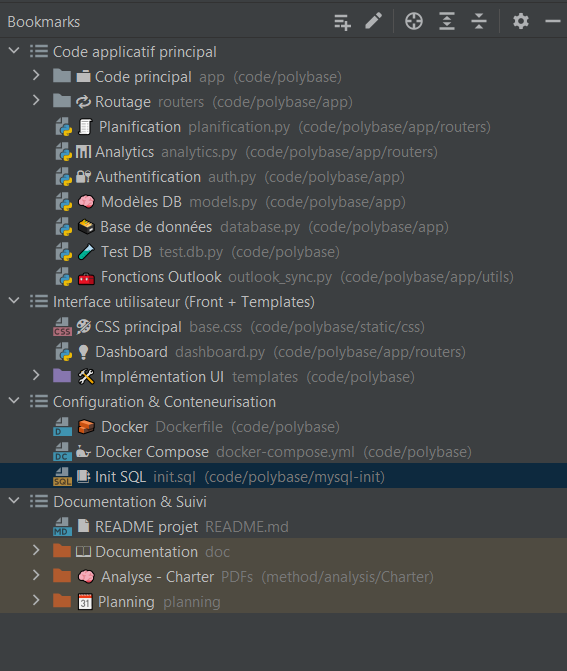

# SmartDataProject – Developer Guide (Internal)

This document provides a structured overview of the key modules and bookmarks defined within the PolyBase codebase to support onboarding, debugging, and contributions from developers and collaborators.

---

## 📘 Developer Bookmarks Overview

All bookmarks are organized according to their function in the architecture and workflow of the PolyBase platform.

---

### 📦 Application Core (Backend)

| 📍 Bookmark         | Path                                              | Purpose                                                |
|---------------------|----------------------------------------------------|---------------------------------------------------------|
| `Code Core`         | `code/polybase/app/`                                | Main FastAPI application with routing and logic         |
| `Routing`           | `code/polybase/app/routers/`                        | REST endpoints grouped by domain                        |
| `Planning`          | `planification.py`                                  | Task planning routes                                    |
| `Analytics`         | `analytics.py`                                      | KPI and dashboard routes                                |
| `Authentication`    | `auth.py`                                           | JWT and session-based authentication                    |
| `Database Models`   | `models.py`                                         | SQLAlchemy models                                       |
| `DB Connection`     | `database.py`                                       | MySQL connection and engine                             |
| `Test Database`     | `test.db.py`                                        | Local test file for DB integration                      |
| `Outlook Sync`      | `outlook_sync.py`                                   | Utility for Outlook calendar integration                |

---

### 🎨 User Interface (Frontend Templates & Static)

| 📍 Bookmark         | Path                                              | Purpose                                                |
|---------------------|----------------------------------------------------|---------------------------------------------------------|
| `UI Templates`      | `templates/`                                        | Jinja2 HTML views                                       |
| `Main Dashboard`    | `dashboard.html`                                    | Central user interface layout                           |
| `Base Stylesheet`   | `base.css`                                          | Shared CSS styles across all templates                  |

---

### 🐳 Configuration & Containerization

| 📍 Bookmark         | Path                                              | Purpose                                                |
|---------------------|----------------------------------------------------|---------------------------------------------------------|
| `Dockerfile`        | `Dockerfile`                                        | Container setup for the API backend                     |
| `Docker Compose`    | `docker-compose.yml`                                | Multi-container orchestration (API + DB)                |
| `Init SQL`          | `init.sql`                                          | MySQL schema initialization script                      |

---

### 📚 Documentation & Project Tracking

| 📍 Bookmark         | Path                                              | Purpose                                                |
|---------------------|----------------------------------------------------|---------------------------------------------------------|
| `Project README`    | `README.md`                                        | Overview and deployment instructions                    |
| `Documentation`     | `doc/`                                             | Technical documents and specs                           |
| `Charter Analysis`  | `method/analysis/Charter/`                         | Project scoping and internal meeting notes              |
| `Planning`          | `planning/`                                        | Gantt charts and roadmap files                          |

---

## 🔖 Screenshot of Bookmarks

For reference, here's the recommended bookmark layout in PyCharm:

---

## 🧭 Best Practices

- Use the **Bookmarks Panel (Shift+F11)** to quickly navigate between key areas.
- Mark new logic, routes, or modules with a clear and meaningful bookmark.
- Avoid modifying excluded folders (`legacy/`, etc.) without prior validation.
- Keep your editor synchronized with the `.venv` interpreter and `.env` configurations.

---

## 👤 Maintainer

This developer guide was prepared by:

- **Esteban BARRACHO**

---

## 📄 License

This documentation and its associated structure are licensed **"All Rights Reserved"**.  
Refer to the root `LICENSE` file for additional terms.
